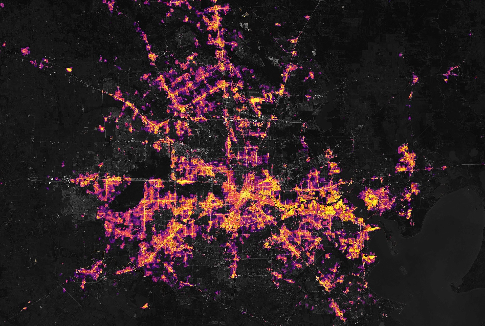

# 2021 Texas Power Crisis: Houston Blackouts Night Lights Data Analysis

Analysis of blackouts and the ensuing power crisis following the 2021 winter storm in the Houston metropolitan area through VIIRS night lights data and more.

[{width="715"}](https://en.wikipedia.org/wiki/2021_Texas_power_crisis)

## Background & Overview

"In February 2021, the state of Texas suffered a major power crisis, which came about as a result of three severe winter storms sweeping across the United States on February 10--11, 13--17, and 15--20."[^readme-1] For more background, check out these [engineering](https://www.youtube.com/watch?v=08mwXICY4JM&ab_channel=PracticalEngineering) and [political](https://www.youtube.com/watch?v=Zcrsgdl_hP0&ab_channel=Vox) perspectives. These videos succinctly convey the severity and immediate consequences of the blackouts that occurred in Texas in the winter storms of early 2021, and convey that the lasting impacts will (and should) be studied for years to come.

[^readme-1]: Wikipedia. 2021. "2021 Texas power crisis." Last modified October 2, 2021. <https://en.wikipedia.org/wiki/2021_Texas_power_crisis> Access date: October 26, 2023.

In the primary analysis notebook, I use VIIRS night lights data, OpenStreetMap data, and US Census Bureau data to: - estimate the number of homes in Houston that lost power as a result of the first two storms\
- investigate if socioeconomic factors are predictors of communities' recovery from a power outage

In my analysis, I'll demonstrate the following skills:

-   load vector and raster data
-   raster manipulation and data processing with the `stars` package
-   perform spatial joins
-   reading simple features and layers from files and GeoPackages using the `sf` package
-   using `sf` to read in data from an ArcGIS ["file geodatabase"](https://desktop.arcgis.com/en/arcmap/latest/manage-data/administer-file-gdbs/file-geodatabases.htm)
-   raster reclassification
-   crop and cut geospatial data through buffering
-   SQL query definition, layer selection
-   use `dplyr` for vector data cleaning
-   `dplyr` summary statistics
-   raster map development in `ggplot2` and `tmap`
-   spatial subsetting, masking, and cropping
-   convert vector data into simple feature collection

## Data

The data used in this project are too large to export to GitHub, so I've provided links to access/download the data for reproducibility below. The night lights data has been preprocessed for academic use, and the file (92.2 MB) is unfortunately too large to upload on GitHub.

### Night lights data

My analysis will be based on remotely-sensed night lights data, acquired from the [Visible Infrared Imaging Radiometer Suite (VIIRS)](https://en.wikipedia.org/wiki/Visible_Infrared_Imaging_Radiometer_Suite) onboard the Suomi satellite. VIIRS data is distributed through NASA's [Level-1 and Atmospheric Archive & Distribution System Distributed Active Archive Center (LAADS DAAC)](https://ladsweb.modaps.eosdis.nasa.gov/).

In particular, I will use the VNP46A1 to detect differences in night lights before and after the storm to identify areas that lost electric power.

I am using two primary nights' data: February 7th and February 16th, as these provide the clearest view (least cloud cover) for the analysis. This data was preprocessed and prepared by Ruth Oliver for the Master of Environmental Data Science's Geospatial Analysis course in the Fall quarter, 2023.

**Citation:**

NASA Earth Data, Level-1 and Atmospheric Archive & Distribution System Distributed Active Archive Center (LAADS DAAC) [Data file] Available from: <https://ladsweb.modaps.eosdis.nasa.gov/> Access date: October 26, 2023.

### OpenStreetMap data

#### Roads

To determine the number of homes that lost power, I link (spatially join) blackout areas with [OpenStreetMap](https://www.openstreetmap.org/#map=4/38.01/-95.84) data on roads to cut out the highways and associated lights (traffic, street lights) from my analysis.

I used [Geofabrik's download sites](https://download.geofabrik.de/) to retrieve a shapefile of all highways in Texas and prepared a Geopackage (`.gpkg` file) containing just the subset of roads that intersect the Houston metropolitan area. 

#### Houses

OpenStreetMap also has building data, which I will use in my analysis to find the number of buildings impacted by the blackouts in the Houston Metropolitan area. The prepared data is in the `gis_osm_buildings_a_free_1.gpkg` Geopackage visible in the repository structure.

**Citation:**

Geofabrik Download Server (2018), OpenStreetMap Data Extracts [Data file] Available from: <https://download.geofabrik.de/> Access date: October 26, 2023.

#### US Census Bureau data

To investigate potential relationships between socioeconomic status and blackout status during the 2021 winter storm, I used data from the [U.S. Census Bureau's American Community Survey](https://www.census.gov/programs-surveys/acs) for census tracts in 2019. This data is within the *folder* `ACS_2019_5YR_TRACT_48.gdb` and is an ArcGIS ["file geodatabase"](https://desktop.arcgis.com/en/arcmap/latest/manage-data/administer-file-gdbs/file-geodatabases.htm), a multi-file proprietary format that's roughly analogous to a GeoPackage file. To explore the contents/layers of the geodatabase, you can access the [ACS metadata](https://www2.census.gov/geo/docs/maps-data/data/tiger/prejoined/ACSMetadata2011.txt)

**Citation:**

United States Census Bureau (2019), American Community Survey [Data file] Available from: <https://www.census.gov/programs-surveys/acs> Access date: October 26, 2023.

## Repository Structure

``` bash
.
├── LICENSE
├── README.md
├── data # too large to export to GitHub, see Data section and Sources
│   ├── ACS_2019_5YR_TRACT_48_TEXAS.gdb # census data
│   │   ├── gdb
│   │   └── timestamps
│   ├── VNP46A1 # night lights data
│   │   ├── VNP46A1.A2021038.h08v05.001.2021039064328.tif
│   │   ├── VNP46A1.A2021038.h08v06.001.2021039064329.tif
│   │   ├── VNP46A1.A2021047.h08v05.001.2021048091106.tif
│   │   └── VNP46A1.A2021047.h08v06.001.2021048091105.tif
│   ├── gis_osm_buildings_a_free_1.gpkg # buildings data
│   └── gis_osm_roads_free_1.gpkg # roads data
├── docs # primary analysis files, Quarto markdown notebook
│   ├── houston-blackouts-nightlights-analysis.html
│   ├── houston-blackouts-nightlights-analysis.qmd
│   └── houston-blackouts-nightlights-analysis_files
│       ├── figure-html # output figures
│       └── libs # quarto css for output
│           ├── bootstrap
│           │   ├── ~
│           ├── clipboard
│           │   └── ~
│           └── quarto-html
│               ├── ~
├── figs # images and figures
└── houston-blackouts-nightlights-analysis.Rproj
```

## Sources

Geofabrik Download Server (2018), OpenStreetMap Data Extracts [Data file] Available from: <https://download.geofabrik.de/> Access date: October 26, 2023.

NASA Earth Data, Level-1 and Atmospheric Archive & Distribution System Distributed Active Archive Center (LAADS DAAC) [Data file] Available from: <https://ladsweb.modaps.eosdis.nasa.gov/> Access date: October 26, 2023.

United States Census Bureau (2019), American Community Survey [Data file] Available from: <https://www.census.gov/programs-surveys/acs> Access date: October 26, 2023.

Wikipedia. 2021. "2021 Texas power crisis." Last modified October 2, 2021. <https://en.wikipedia.org/wiki/2021_Texas_power_crisis>. Access date: October 26, 2023.
